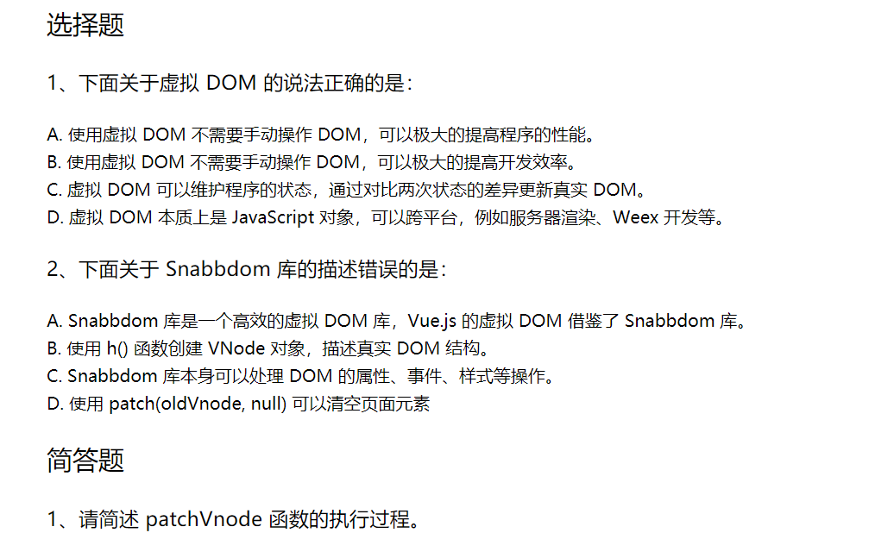

## 答案
### 选择题
#### 1、A、B、C、D
#### 2、A、C

### 简答题
patchVnode主要有以下四个方面（都是在同级比较）
①先通过sameNode比较sel和key，看是否相同，如果不同，就直接替换
②如果都是textNode，就直接看内容是否有改变
③看vnode和oldVnode是否都有child，如果vnode没有，就通过removeVnode把oldVnode中的子节点删除，如果oldVnode没有，就使用addVnode在oldVnode中增加子节点
④如果都有child，就一个个地比较，先头头、尾尾、头尾、尾头进行比较，没找到的情况下，如果有key就通过key来找，没有key就使用循环